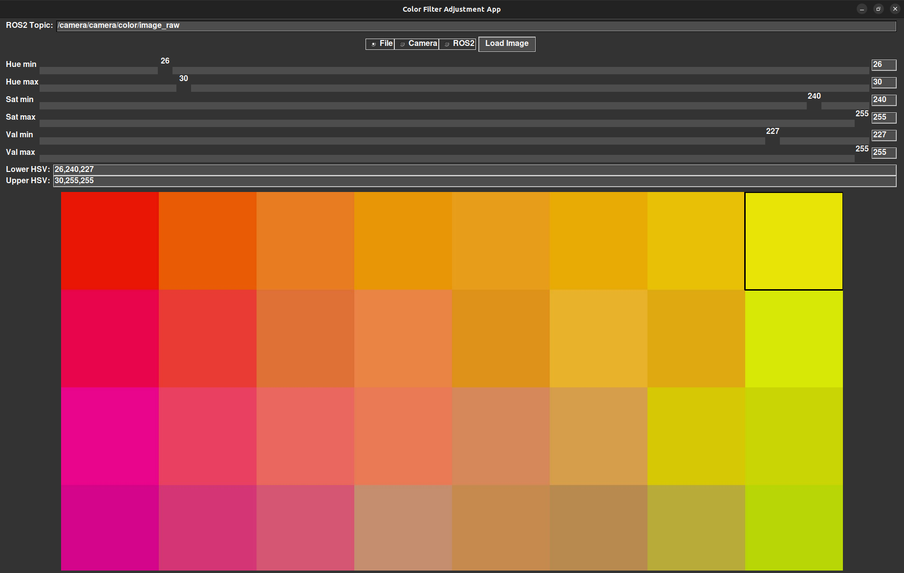

Simple color filter app in dark mode intended for robotics perception. 
Allows simple GUI input from a file, web camera, or ros2 image topic. 
Easily selectible and fun to tune. 

Should work in any enviorment that support ROS2
